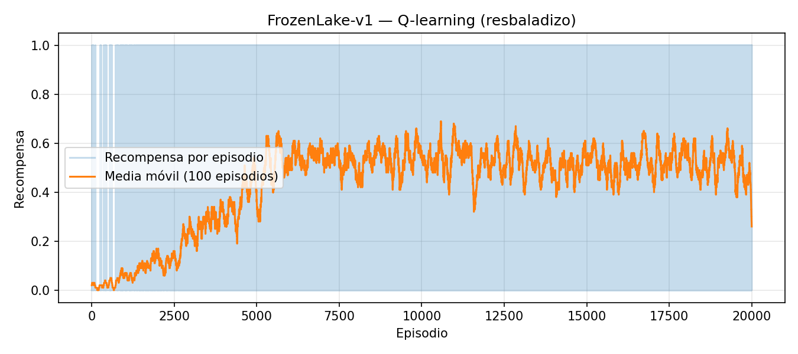
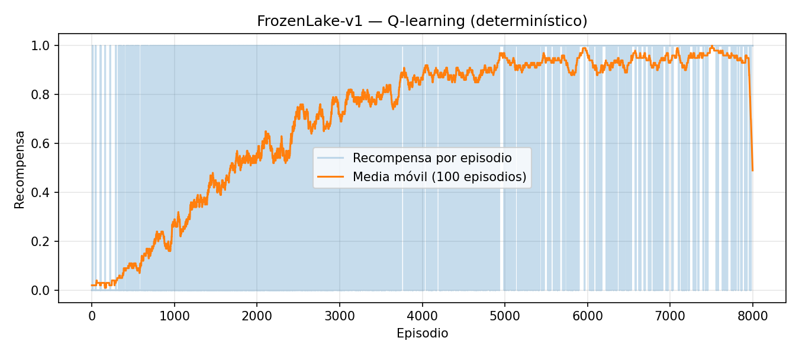

# Desafío práctico — Aprendizaje por refuerzo I

**Maestría en Inteligencia Artificial — Universidad de Buenos Aires**  
**Asignatura:** Aprendizaje por refuerzo I  
**Modalidad:** trabajo individual  

**Repositorio de código y figuras:**  
https://github.com/sevann-radhak/UBA-b03-Aprendizaje-por-refuerzo-1.git  

---

## Resumen

Se implementó el algoritmo **Q-learning** tabular sobre el entorno discreto **FrozenLake-v1** de Gymnasium, en dos variantes: mapa **resbaladizo** (transiciones estocásticas) y **determinístico**. Se registró la recompensa por episodio, se construyeron curvas de aprendizaje con media móvil y se evaluó la política greedy resultante mediante episodios independientes. En el caso determinístico la convergencia hacia recompensa 1 es clara; en el resbaladizo la recompensa esperada por episodio se estabiliza por debajo de 1 debido a la incertidumbre del entorno, aunque la política greedy alcanza una tasa de éxito razonable en evaluación.

---

## 1. Introducción

El objetivo del trabajo es aplicar un método clásico de aprendizaje por refuerzo sin aproximación funcional, sobre un MDP finito con espacio de estados y acciones pequeños, de modo que la tabla de valores Q sea trazable y analizable. Se eligió **Q-learning** por ser un método off-policy ampliamente utilizado en tabulación y por permitir comparar de forma directa el efecto del **ruido en las transiciones** (parámetro `is_slippery` del entorno) sobre la curva de aprendizaje y sobre el desempeño de la política greedy aprendida.

---

## 2. Problema y entorno

**FrozenLake-v1** modela un agente que debe desplazarse en una grilla 4×4 evitando casillas “agujero” y alcanzando la meta. Las acciones son discretas (cuatro direcciones). La recompensa es 1 al llegar a la meta y 0 en el resto de las transiciones. El episodio termina al caer en un agujero o al alcanzar la meta.

En la variante **resbaladizo**, la dinámica real del siguiente estado puede no coincidir con la acción elegida, lo que introduce **estocasticidad** y dificulta la estimación estable de valores. En la variante **no resbaladiza**, el entorno se comporta como un MDP casi determinístico (salvo reinicios), lo que facilita verificar que el algoritmo y la implementación son correctos.

---

## 3. Fundamentos: Q-learning

Sea un MDP finito con conjunto de estados \(S\) y acciones \(A\). El Q-learning actualiza la estimación \(Q(s,a)\) tras cada transición \((s, a, r, s')\) mediante:

\[
Q(s,a) \leftarrow Q(s,a) + \alpha \big[ r + \gamma \max_{a'} Q(s',a') - Q(s,a) \big],
\]

donde \(\alpha\) es la tasa de aprendizaje y \(\gamma\) el factor de descuento. La política de comportamiento fue **\(\epsilon\)-greedy** con \(\epsilon\) decreciente episodio a episodio, de modo de equilibrar exploración y explotación. La política evaluada en la sección de resultados es la **greedy** respecto de la tabla Q final: en cada estado se elige \(\arg\max_a Q(s,a)\).

---

## 4. Diseño experimental

Los hiperparámetros se mantuvieron iguales entre ambas variantes del entorno, salvo el número de episodios en el caso determinístico (menor, por convergencia más rápida).

| Hiperparámetro | Valor |
|----------------|-------|
| Tasa de aprendizaje \(\alpha\) | 0,1 |
| Descuento \(\gamma\) | 0,99 |
| \(\epsilon\) inicial | 1,0 |
| \(\epsilon\) mínimo | 0,05 |
| Decaimiento multiplicativo de \(\epsilon\) | 0,9995 por episodio |
| Semilla (numpy) | 42 (entrenamiento) |
| Episodios (resbaladizo) | 20 000 |
| Episodios (determinístico) | 8 000 |

La métrica principal de aprendizaje es la **recompensa acumulada por episodio** (en este entorno coincide con 1 si se alcanzó la meta y 0 en caso contrario). Para suavizar el ruido de muestreo se reporta además la **media móvil** de 100 episodios sobre la serie de recompensas.

La evaluación de la política greedy se realizó con **2 000 episodios** nuevos, reiniciando el entorno con semillas aleatorias independientes del entrenamiento (`evaluate_policy.py`, semilla base 123).

---

## 5. Implementación

El código está en Python 3, utilizando **Gymnasium** para el entorno y **NumPy** para la tabla Q y el muestreo. La tabla se inicializa en cero. En cada paso se aplica la regla de Q-learning con bootstrap \(\max_{a'} Q(s',a')\); al ser episodios finitos y tabulares, no se requiere red neuronal ni buffer de experiencias.

A continuación se reproduce, de forma condensada, el núcleo del entrenamiento (bucle por episodio y paso de actualización):

```python
q = np.zeros((n_states, n_actions))
epsilon = eps_start
for _ in range(episodes):
    state, _ = env.reset(seed=...)
    terminated = truncated = False
    while not (terminated or truncated):
        if rng.random() < epsilon:
            action = int(rng.integers(n_actions))
        else:
            action = int(np.argmax(q[state]))
        next_state, reward, terminated, truncated, _ = env.step(action)
        best_next = float(np.max(q[next_state]))
        td_target = reward + (0.0 if terminated else gamma * best_next)
        q[state, action] += alpha * (td_target - q[state, action])
        state = next_state
    epsilon = max(eps_min, epsilon * eps_decay)
```

Los scripts `scripts/qlearning_frozenlake.py` y `scripts/evaluate_policy.py` generan los archivos en `informe/assets/` (CSV de recompensas, PNG de convergencia y `qtable_*.npy`).

---

## 6. Resultados

### 6.1 Curvas de aprendizaje

**Entorno resbaladizo.** La recompensa por episodio presenta alta varianza; la media móvil muestra una tendencia creciente hacia una zona de estabilización en torno a valores intermedios (recompensa esperada por episodio menor que 1 por la estocasticidad). La recompensa media en los últimos 500 episodios de entrenamiento fue aproximadamente **0,47**.



**Entorno determinístico.** La media móvil converge claramente hacia **1**, coherentemente con un camino óptimo estable. La recompensa media en los últimos 500 episodios fue aproximadamente **0,96**.



### 6.2 Evaluación greedy

| Variante | Tasa de éxito (2000 episodios) |
|----------|-------------------------------|
| Q aprendida en mapa resbaladizo, evaluada en mapa resbaladizo | 0,748 |
| Q aprendida en mapa determinístico, evaluada en mapa determinístico | 1,000 |

La tasa perfecta en el caso determinístico confirma que la tabla Q codifica una política que alcanza la meta de forma consistente bajo la misma dinámica de entrenamiento. En el caso resbaladizo, incluso una política razonable puede fallar ocasionalmente por las transiciones aleatorias, de ahí que la tasa de éxito sea menor que 1 aun después del entrenamiento.

---

## 7. Dificultades encontradas

1. **Varianza en el mapa resbaladizo:** la misma política greedy puede conducir a trayectorias fallidas por deslizamientos; la curva cruda por episodio oscila fuertemente y obliga a interpretar el aprendizaje con suavizado.  
2. **Calibración de \(\epsilon\) y duración:** un decaimiento demasiado rápido reduce la exploración antes de visitar estados críticos; uno demasiado lento alarga la fase de ruido en la recompensa.  
3. **Corrección de detalles de implementación:** la condición de término del episodio debe considerar `terminated` y `truncated` según la API de Gymnasium para evitar pasos ilegales o actualizaciones inconsistentes.

---

## 8. Conclusiones

Se completó un pipeline reproducible de **entrenamiento Q-learning**, **registro de métricas por episodio**, **visualización de convergencia** y **evaluación de política** sobre FrozenLake-v1. La comparación entre entorno determinístico y resbaladizo ilustra de manera directa cómo la estocasticidad del modelo de transición limita la recompensa esperada por episodio y la tasa de éxito bajo greedy, incluso con tabulación exacta en el espacio de pares estado–acción. Como extensión natural del trabajo se podría experimentar con **n-step** o **Expected SARSA** en el mapa resbaladizo para reducir la varianza del operador bootstrap, o pasar a aproximación funcional (**DQN**) en entornos con espacio de estados mayor.

---

*Fin del informe.*
